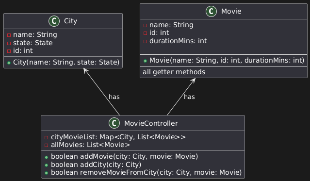
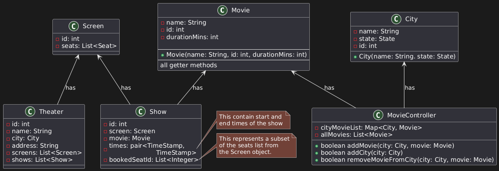
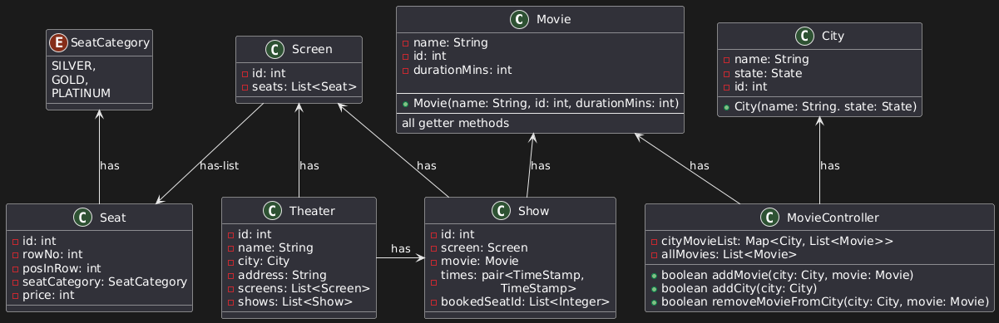
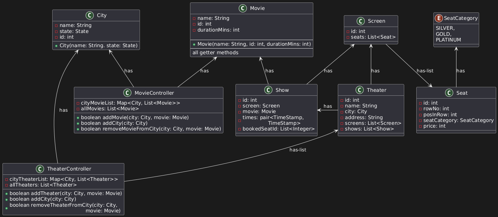
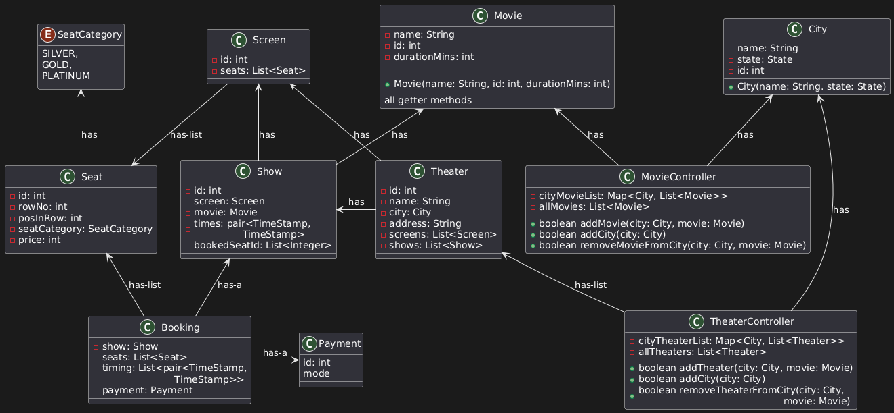

# Movie Ticket Booking Application

Design a low-level architecture for a ticket booking platform similar to BookMyShow. Once the design is finalized, we will address concurrency-related challenges, such as multiple users booking the same seat simultaneously.

Similar to BookMyShow. As soon as we are done with design, follow up question will be concurrency. 

## Rough User Flow
1. User opens the app and logs in.
2. User selects the current city to view localized listings.
3. Based on the selected city, the app displays:
    - All available movies
    - All running theaters
4. Booking via Movie Selection
    - User selects a movie
        - System shows all theaters in the selected city where the movie is playing.
        - User selects a theater → available show timings are shown.
        - User selects a timing → available seats are displayed.
        - User selects seats → proceeds to payment → booking confirmed.
5. Booking via Theater Selection
    - User selects a theater
        - System displays all movies and showtimes available in that theater.
        - User selects a movie and time → selects seats → completes payment → booking confirmed.

## Core Components:
1. User
2. City
3. Movie
4. Theater
5. Screen/Halls (a single theater can have multiple screens.)
6. Seat
7. Show timing
8. Ticket
9. Booking
10. Payment

## Discussion on Design

We begin by creating the `Movie` object, which serves as the foundational entity in the system. In a typical movie ticket booking application, movies are closely associated with specific cities — users can only view movies that are currently running in their selected city, not across the entire country.

To model this behavior, we introduce a new class called `MovieController`. This class is responsible for managing the movie listings in a city-specific manner. It maintains:
- `cityMovieList`: a mapping of cities to the list of movies available in each city.
- `allMovies`: a centralized list containing all movies available in the system.

This structure ensures a clear separation between global movie data and city-specific listings

 

Next, we move on to designing the `Theater` component. Each theater consists of multiple **screens (or halls)**, and each screen can host multiple **shows**, which represent a specific **movie** being played at a particular **time** on a particular **screen**.

While designing the `Screen` class, it's important to incorporate the seat layout, as it defines the arrangement of **seats available** for booking.

Show encapsulates the relationship between:
- A movie
- A screen
- A specific show time

We also need to track which seats have already been reserved for each show. To achieve this, the `Show` class maintains a structure to record **bookedSeatId**. This can be implemented as:

- A list of **booked seat IDs**
- Or a list of `Seat` objects representing the booked seats

 

-----------
- **Note:** 

    Initially, we represented show timings as a `List<Pair<Timestamp, Timestamp>>` within a single `Show` instance—intending to handle multiple timings for the same movie in one object. However, this approach complicates booking management, show tracking and storing already booked seat information for each show.

    To simplify the system, we revise this design by representing each show timing as a **separate** `Show` instance, with a single `Pair<Timestamp, Timestamp>` indicating the start and end time. Even if a movie runs multiple times on the same screen in the same theater, **each run is treated as an independent show**.

---------

To manage seat-related information effectively, we introduce a dedicated `Seat` class. During the design process, we observe that seats can belong to different categories (e.g., Silver, Premium, Gold), and the pricing varies based on the category.

To accommodate this, we introduce a separate `SeatCategory` enum, which defines the various seat types along with their associated pricing and features. Each Seat instance will be linked to a specific SeatCategory, allowing the system to dynamically determine seat prices and organize seating layouts accordingly.

 

Since theaters are closely tied to specific cities—users can only view and book shows in theaters within their selected city—we need to maintain a clear mapping between cities and theaters.

To manage this relationship efficiently, we introduce a `TheaterController`, similar to the previously defined `MovieController`. The `TheaterController` will be responsible for maintaining:

- A mapping of **cities to their respective theaters**
- A centralized list of **all theaters** in the system

 

The remaining components in our design are the Booking and Payment classes.

 

## Integrating All Components

Now we are only pending with Booking and Payment object. Here while desiging the Booking class we understand that we made a wrong decission by giving taking timing var as List<pair<TimeStamp,\n\t\t\tTimeStamp>> in Show class. Instead of this we should take timing as pair<TimeStamp,\n\t\t\tTimeStamp> and each time the movie runs might be in the same threadter in the same screen, we treat it as a separate show. By not keeping all the timings together managing each show and taking booking will be much more easy.

To tie all components of the system together, we introduce a central coordinating class named `BookMyShow`, which acts as the main entry point of the application. This class orchestrates the setup and interaction flow across all modules.
1. Define the list of cities supported by the platform.
2. Add movies and associate them with the cities where they are currently available.
3. Create Theaters
    - For each theater:
        - Associate it with a specific city.
        - Create one or more screens.
        - Define the seat layout for each screen.
        - Schedule shows for specific movies on the screens.
4. Now user comes to book movie
    - User selects a city (e.g., CITY-A)
    - User selects a movie (e.g., MOVIE-A)
    - The system fetches:
        - All theaters in `CITY-A` where `MOVIE-A` is running
        - All available shows per theater
    - User selects a specific show
    - User proceeds to seat selection and payment
    - On successful payment, the booking is confirmed and the selected seats are marked as booked.

## Concurrency Handling in Seat Booking

### Requirements:
1. Prevent Double Booking
    - A seat should not be booked by multiple users, even if they attempt to book it at the exact same time.

2. Seat Hold Mechanism
    - When a user (e.g., User-1) initiates a booking, the selected seat(s) should be temporarily reserved for a fixed duration (e.g., 10 minutes).
    - If payment is not completed within this window, the seat should be **automatically released and made available to others.**

### Locking Strategy

There are two primary locking strategies:
    - **Pessimistic Locking** – Blocks all access during a write, ensuring exclusive access but reducing concurrency.
    = **Optimistic Locking** – Assumes minimal conflict; allows concurrent reads and uses version checks during write to ensure consistency.

### Chosen Strategy: Optimistic Locking

Given our use case where:

- Many users may view (read) seat availability simultaneously
- Only one user should be allowed to confirm the booking (write)

...**Optimistic Locking** is preferred for performance and scalability.

### Booking Flow with Version Control
- Each **seat** maintains a **version number**.\
- When a user reads the seat data, they also read and store the version.
- During booking (write operation), the system:
    1. Enters a synchronized block, can only be executed by one user at a time
    2. Checks the current version of the seat.
    3. If the version matches the one the user read earlier, it proceeds to:
        - Reserve the seat
        - Increment the version number
    4. If the version does not match, it means another user has already updated the seat. The booking fails.

This mechanism ensures **no two users can book the same seat simultaneously**, thus satisfying the first concurrency requirement.

### Releasing Seat Reservations

To handle temporary seat blocking, we implement **seat hold timeouts**:

- **User-initiated release:** If the user cancels or fails to pay, the seat is released.
- **Automated timeout:**
    - Use Redis with TTL (Time-To-Live) to store temporary locks.
    - After 10 minutes, if payment is not confirmed, the lock expires and the seat is automatically released back to the pool.