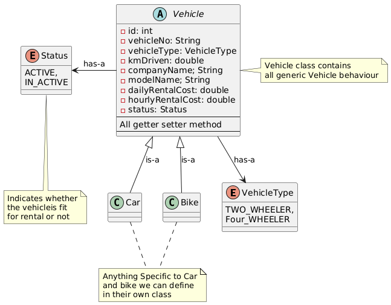
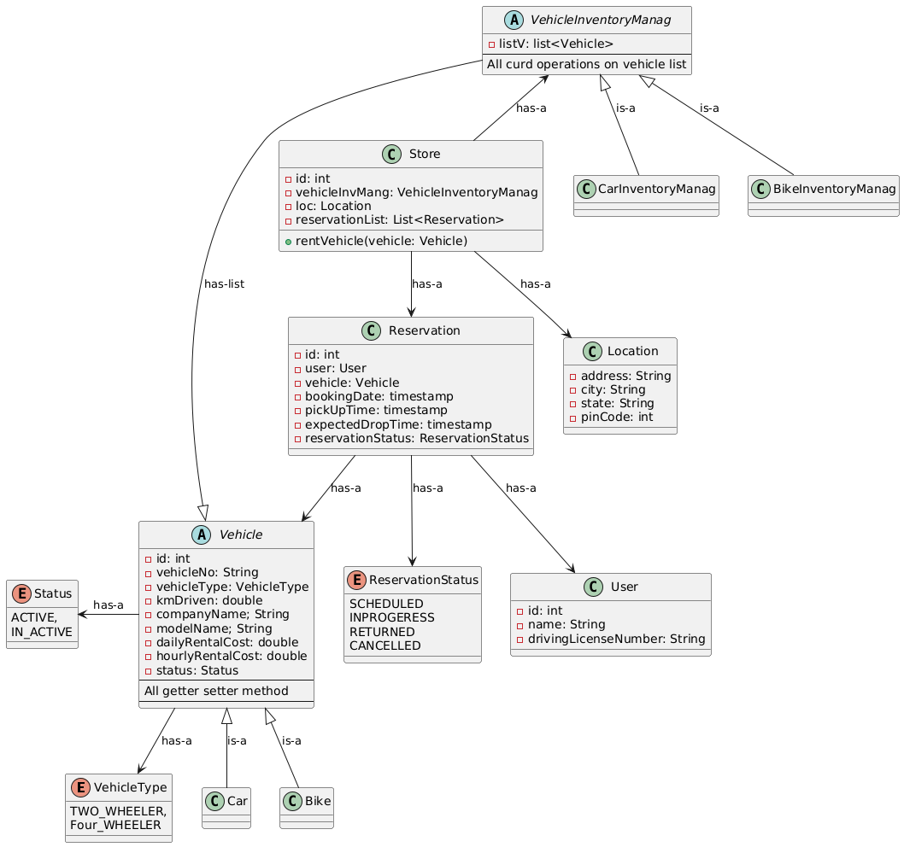
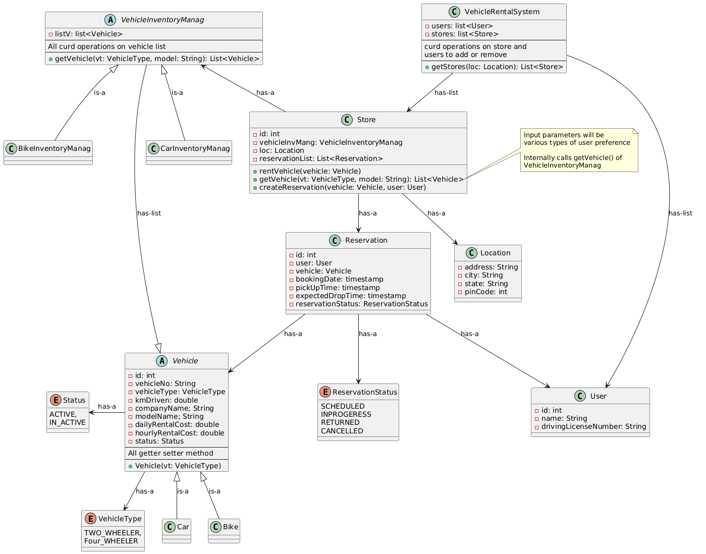
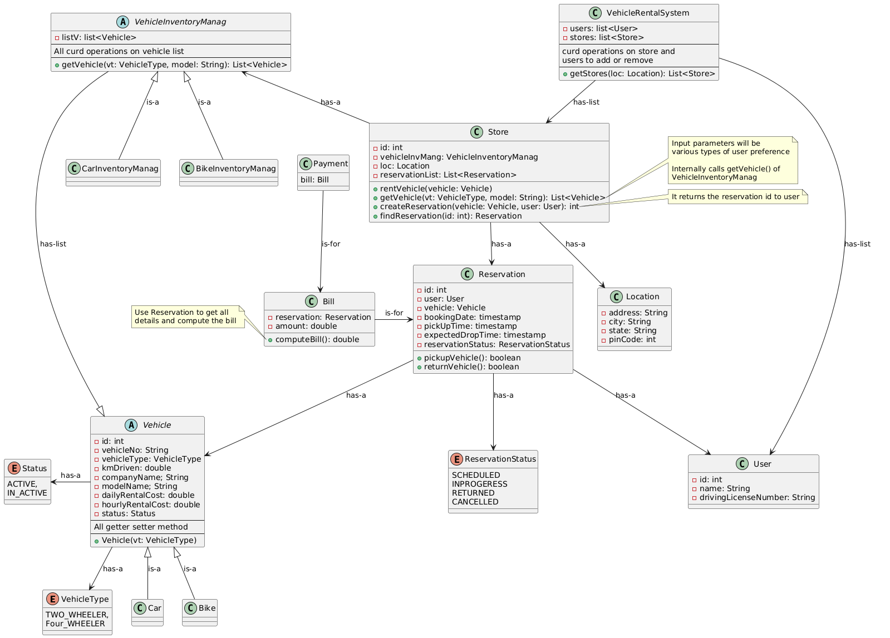

# Car Rental System | ZoomCar

Before jumping into the design, keep the following points in mind:

1. **Keep It Simple:** Interviewers often tend to say "yes" to any new feature you propose. Avoid overcomplicating the design—focus on building a clear and scalable base first.
2. **Stick to the Core:** Implement only the essential functionality unless you're absolutely sure about a specific additional feature's scope and necessity.
3. **Clarify the Use Case:** Zoomcar offers two main features:
    - Renting out your car (as an owner)
    - Renting a car (as a customer)

        In this design, **we are only focusing on the user journey for renting a car**. Do not include the "list your car" functionality unless explicitly asked.

## Design Notes

### Rough Flow

Let’s discuss the typical user flow when renting a car through an app like Zoomcar:

1. The user logs into the Zoomcar app or website.
2. Based on the user's location, the system displays nearby rental stores or individual owners offering vehicles.
3. Each store or individual may offer multiple vehicles. The user can filter vehicles based on preferences and choose one to rent.
4. Once a vehicle is selected, the system reserves it for the user.
5. A bill is generated. The payment status can be:
    - Unpaid
    - Partially Paid
    - Fully Paid
6. An official invoice is created post-reservation and billing.
7. Vehicle Status During Reservation: `SCHEDULED`, `INPROGERESS` (or `PICKED`), `RETURNED`, `CANCELLED`
8. User pick up the vehicle, use it and return.

### Core Components

From this flow key domain Objects Identified -- 

1. User
2. Location
3. Store (or Owner)
4. Vehicle – Associated with each store; categorized into 2-wheeler or 4-wheeler
5. Bill – Can be `UNPAID`, `PARTIALLY_PAID`, or `FULLY_PAID`
6. Invoice
7. Payment

### Discussion on Core Components

#### Vehicle:

Let's start by designing the `Vehicle` component. Instead of restricting it to just cars or four-wheelers, we'll keep the design extensible. We'll introduce a `VehicleType` enum—initially with `TWO_WHEELER` and `FOUR_WHEELER`—which can be expanded later. Each vehicle will have a type from this enum and a `VehicleStatus` enum to indicate whether it's `ACTIVE` or `INACTIVE` (e.g., under maintenance).

#### Store

To keep the design simple, we will treat `Store` (or the vehicle owner) as a single unified entity.

To manage the vehicles in a store, we introduce an abstract class `VehicleInventoryManager`. Its concrete implementations will be `CarInventoryManager`, `BikeInventoryManager`, etc. Each `Store` has its own `VehicleInventoryManager`. This design allows easy extensibility—if a new vehicle type is introduced, we simply add a new subclass of VehicleInventoryManager and plug it into the store. This approach minimizes changes in the `Store` class and provides better flexibility compared to directly managing a vehicle list within `Store`.

Each store also maintains its own list of reservations. A `Reservation` object should contain the user, vehicle, and other relevant details. The user’s registered location is not important here—only the current location matters, as the user might be traveling and should see only vehicles near their present location.

#### VehicleRentalSystem

This component is responsible for maintaining the complete list of users and stores within the system. It supports dynamic operations such as adding and removing users or stores. Additionally, it provides a method `getStores(Location loc)` that returns all stores near a given location.

Once the nearby stores are identified, the system should retrieve vehicles that match the user's preferences. Since each `Store` holds a reference to a `VehicleInventoryManager`, the store delegates this filtering responsibility to its `VehicleInventoryManager`, which returns a list of matching vehicles based on the user's criteria.

After the user selects a vehicle, the store should expose a method to create a reservation. This method `createReservation` creates a `Reservation` for the selected user and vehicle, and adds it to the store’s reservation list.

#### Bill and Payment

Once a reservation is successfully created, a corresponding `Bill` object should be generated. The `Bill` is directly associated with a specific `Reservation`. Likewise, any `Payment` made is linked to a `Bill`.

When the user arrives at the store to pick up or return the vehicle, they will provide their reservation ID. Using this ID, the system must locate the associated `Reservation` object. To support this, the `Store` class should offer a `findReservation(reservationId)` method.

Additionally, the `Reservation` class should include methods such as `pickupVehicle()` and `returnVehicle()` to update the reservation status accordingly during these stages.

To enhance flexibility, the `Payment` component can be further extended to support multiple payment methods such as cash, card, UPI, etc., by introducing different payment types or strategy implementations.

