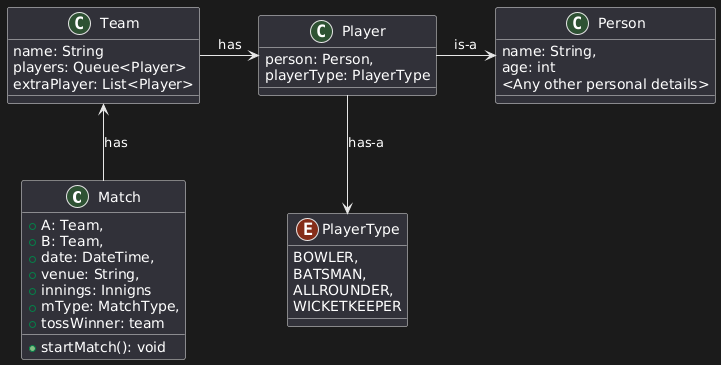
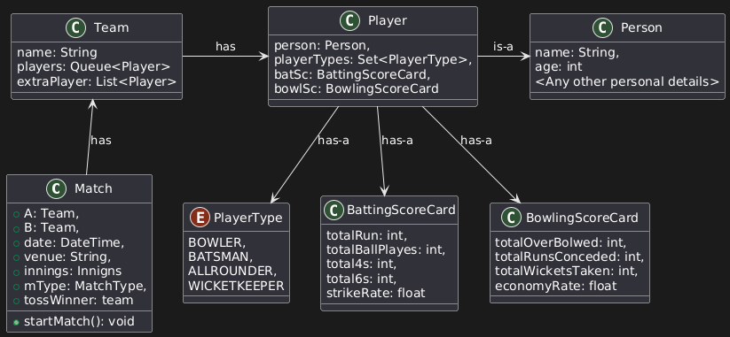
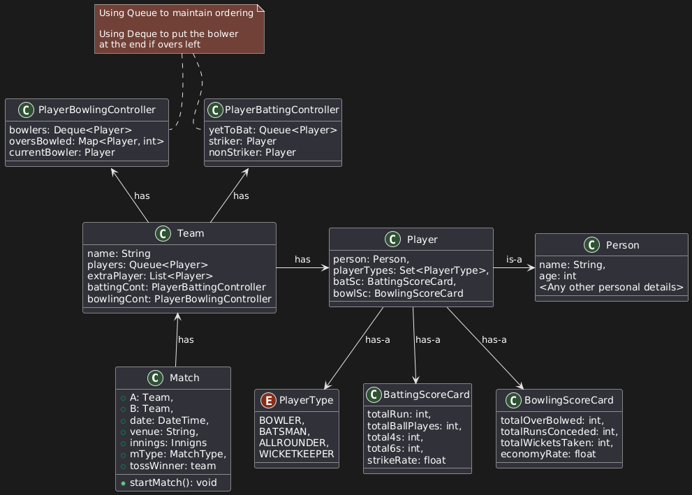
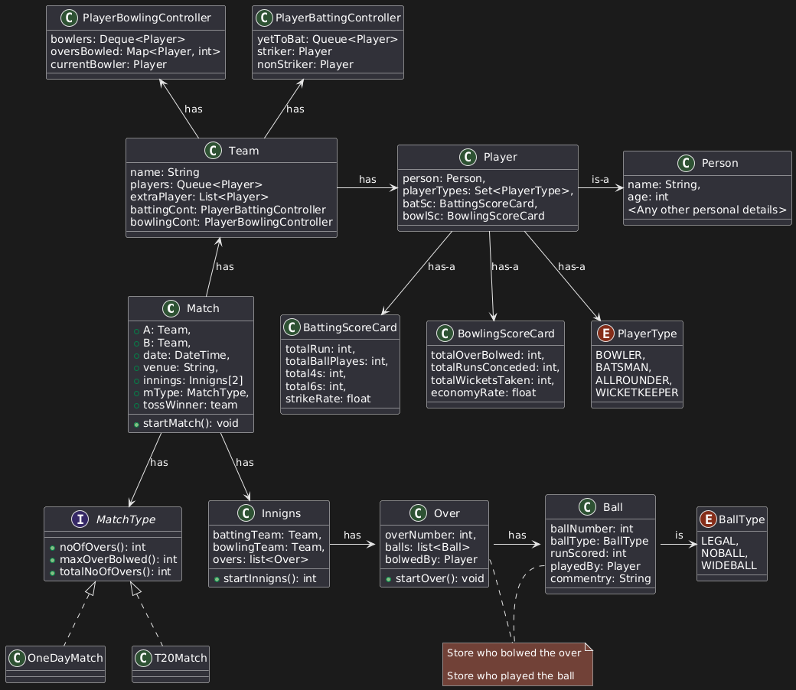
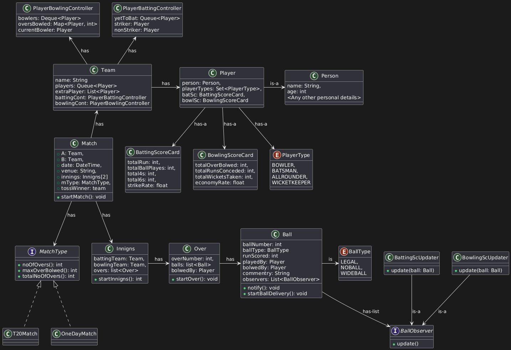
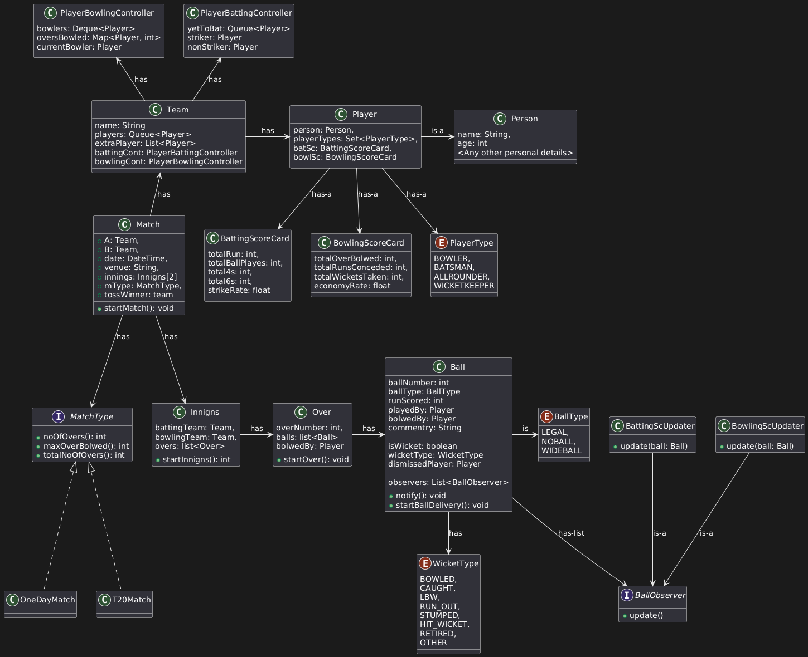

# Cricbuzz - Like Live Cricket Score Platform

Cricbuzz provides real-time updates on ongoing and past cricket matches. Here's how the platform typically operates from a user's perspective:

## User Interaction Flow

1. Users land on the homepage displaying a list of ongoing, upcoming, and recently finished matches.
    - Each match shows a summary: teams involved, current status (live/completed), and basic score info
2. The user selects a match to see detailed information.
3. Match Detail View:
    - For the selected match, Cricbuzz shows:
        - Ball-by-ball commentary
        - Live score updates
        - Scorecard with individual player stats
        - Innings breakdown
    - If the match is ongoing, all information is dynamically updated as the match progresses.

## Key Objects 
1. Match
2. Team
3. Player
4. Innings
5. Over
6. Ball
6. Scorecard

## Design Approach 

Lets begin with constructing the class diagram, starting from the top with the `Match` class and progressively moving downward. While designing the `Match` class, we will concurrently define the foundational classes it depends on— like `Team`, `Player`, `Person`, and `PlayerType`.

As observed, Cricbuzz maintains detailed statistics for each player in both batting and bowling contexts — such as the number of balls faced, boundaries scored, overs bowled, and runs conceded. To model this effectively, each `Player` should be associated with a `BattingScoreCard` and a `BowlingScoreCard`, capturing their individual performance metrics.

Additionally, a player can serve multiple roles (e.g., both a batsman and a wicketkeeper), to accomodate this, the `PlayerType` field should be refactored to a `Set<PlayerType>`, allowing multiple designations per player.

To effectively manage dynamic match states such as the current striker, non-striker, next batsman, players who are out, and those yet to bat—as well as the bowler currently delivering and the one scheduled to bowl next—it is essential to encapsulate this logic within the respective team context.

To achieve this, we will maintain two dedicated components for each `Team`: a `BattingController` and a `BowlingController`. These controllers will be responsible for tracking and updating the state of the game for their respective roles, ensuring accurate and consistent information flow throughout the match lifecycle.

Next, we consider the concept of `MatchType`. A match can be of various formats such as T20, One-Day, Test, or even a custom format like 10-10. Each match type imposes specific rules and constraints—for example, maximum overs per innings, number of innings. These format-specific rules will be encapsulated within the MatchType interface.

One of the critical aspects of our design is ensuring that the scorecard is updated in real-time as each ball is delivered. This makes the **Observer design pattern** an ideal fit. Each time a new ball is recorded, all relevant components—specifically, the batting and bowling scorecards—should automatically receive the updated information and refresh their state accordingly.

To implement this:
- We define a generic `Observer` interface, which will be implemented by two concrete classes: `BattingScoreCardObserver` and `BowlingScoreCardObserver`.
- The Ball class acts as the observable in this pattern. It maintains a list of observers and provides a `notify()` method that is responsible for notifying all registered observers whenever a ball is delivered.
- The Ball class will also have a `startBallDelivery()` method, which represents the actual delivery of the ball. This method triggers the `notify()` method, ensuring that observers are updated with the latest information.
- To allow accurate updates to the bowling scorecard, the `Ball` class must store the bowler's information explicitly. Although this was previously tracked in the `Over` class, it is essential for each ball to have a reference to the bowler so the observer logic can function correctly.

Once these components are in place, each observer’s `update()` method will be triggered with full context about the ball—including runs scored, batsman involved, bowler, and any special events like wickets or extras.

One important aspect we initially overlooked is the wicket-related information. To capture dismissals during the match, we need to incorporate wicket details into the Ball class. This will ensure that each ball instance contains complete data, including whether a wicket fell and the relevant dismissal information.

