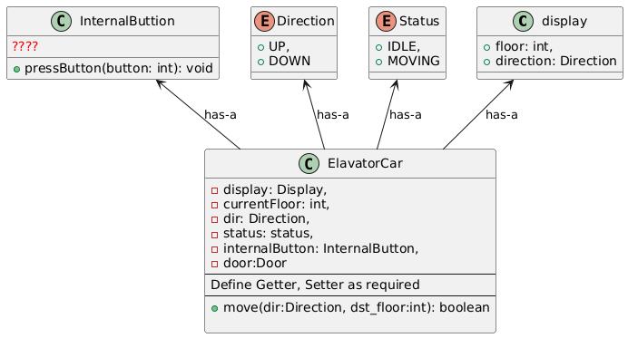
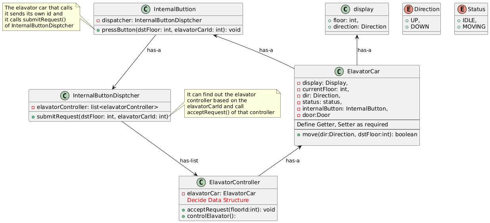
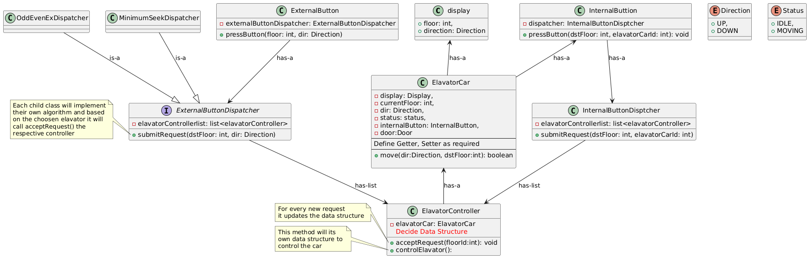
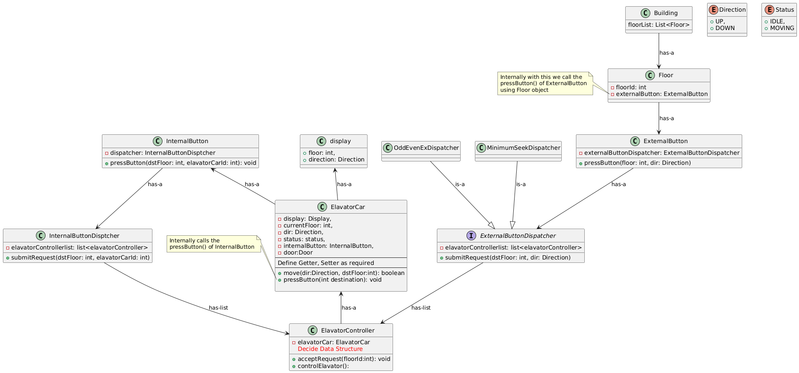

# Elevator System Design

We’re tasked with designing an elevator system. To start, let’s consider a simple use case:
- A person on the 3rd floor wants to go to the 1st floor and presses the button.

##  Requirement Clarification

1. How many elevators are present?
    - Let's assume `n` elevators.
    - The system should allow configuration for any number of elevators with minimal code changes.

2. How do we decide which elevator serves a request (lift dispatch algorithm)?
    - Must be extendable to support multiple dispatching strategies (e.g., round robin, nearest lift, odd/even floors).

## Design Notes

### Core Components

Here are the primary components in the system from the simple use case we had earlier --
1. Building
2. Floor
3. External Button
3. Elavator Car / lift
    - Internal Display
    - Internal Button
    - Direction  (Enum: UP, DOWN)
    - State  (Enum: MOVING, IDLE)
    - Current Floor
4. Outside Display
    
### Discussion on Core Components

1. **Elevator Car:**

    The Elevator Car is a *dumb object*—it simply follows instructions such as "go up to the 5th floor" or "go down to the 1st floor." It doesn't make decisions on its own.

    Internally, the elevator should have a panel with buttons to allow users to select their desired floor. At the very least, it should support a **pressButton()** functionality.

    

    Currently we are sure about what other methods or variables should `InternalButton` should have. We will figure out as we progress.

2. **Elevator Controller:**

    Since the **Elevator Car** is a passive object that simply follows commands, we need a separate component to control its operations. This is where the **Elevator Controller** comes in.

    Each elevator will have its own dedicated **ElevatorController**, responsible for processing user requests and instructing the elevator to move accordingly. In real-world scenarios, multiple requests may arrive simultaneously (e.g., from different floors or users). To manage this efficiently, the controller must maintain an internal data structure to organize, prioritize, and process these requests. We'll finalize the choice of data structure based on the algorithm we implement later.

3. **Request Dispatcher:**

    Now, where do these requests come from?
    - **Internal requests:** Generated when a user inside an elevator presses a button to select a floor.
    - **External requests:** Generated when a person waiting outside presses the "Up" or "Down" button on any floor.

    To handle these, we introduce **Request Dispatchers**—one for internal requests and one for external requests.

    - The ***InternalDispatcher*** directs the request to the specific elevator's controller. For instance, if a user in Elevator-1 presses "Floor 5", the request should be handled by ElevatorController-1 and not by any other elevator.

    - The **ExternalDispatcher** is responsible for determining which elevator should respond to a floor call (e.g., when someone presses "Up" on Floor 3). The decision is based on dispatching logic or algorithms, which we’ll explore in detail later.

    

4. External Button Dispatcher

    When there are multiple elevators in a building and a person on the 3rd floor presses the Up or Down button, a key question arises:
    Which elevator should respond to this request?

    The answer depends on the elevator dispatching algorithm used. Some common strategies include:

    - **Odd/Even assignment** – Certain elevators serve only odd or even floors.
    - **Fixed Floor allocation** – Specific elevators are assigned to certain ranges of floors.
    - **Minimum Seek Time** – The elevator that can reach the requesting floor the fastest is selected.

    We should design the **ExternalButtonDispatcher** in a plug-and-play manner. This means it should support the **Strategy Design Pattern**, where different dispatching algorithms can be implemented as separate strategy classes.

    

5. Floor & Building
    
    We also need floor object and each floor has a external button. A building has multiple floors.

    

#### Overall Flow of Request Handling
1. User presses an external button on a floor.
2. The ExternalButtonDispatcher chooses the most suitable elevator.
3. The request is passed to that elevator’s controller.
4. The user enters the lift and presses an internal button.
5. The internal dispatcher handles it and updates the controller.
6. The ElevatorController handles movement of the elevator accordingly.

### Algorithms 

There are two key areas where algorithms are required:

1. External Button Dispatcher
    - For assigning the best elevator among multiple cars.
2. Elevator Controller
    - For optimizing the car’s internal movement path.

### Elavator Algorithm

Let's begin by discussing Elevator Controller. To be specific the controller needs to manage different combinations of requests such as:

| User Request | Lift Direction |
| ------------ | -------------- |
| Down    |  Down      |
| Up      |  Down      | 
| Up      |  Up        | 
| Down    |  Up        | 

We use SCAN algorithm also known as Elavator Algorithm. SCAN algorithm always goes to the **extreme end** (top or bottom floor) in the current direction, even if there are no requests beyond a certain floor. This leads to **unnecessary travel and delay**, especially when there are no waiting users at those far ends.

The **LOOK algorithm** improves upon SCAN by **"looking ahead"** — it **only goes as far as the last request** in the current direction and then reverses, avoiding unnecessary movement to empty floors. This results in **better response time** and more **efficient elevator usage**.

### Implementation of LOOK Algorithm

We use two priority queues to manage requests efficiently in both directions:

1. Min-Heap (`minPQ`)
    - stores all upward requests (floors > current floor).
2. Max-Heap (`maxPQ`) 
    - stores all downward requests (floors < current floor).
3. Direction
    - current direction of the elevator (`UP` or `DOWN`).
4. Pending Queue (optional)
    - For deferred requests not served in the current direction. For example lets say Elevator is at **3rd floor, moving UP**.
        - External Requests:
            - Floor 5 (up)
            - Floor 6 (up)
            - Floor 2 (up) 
        Here, the request from **2nd floor** (up) can't be served right now because the elevator is **already above it and going up**.

### Design Improvement: Plug-and-Play Elevator Controller Algorithms

In our current elevator system design, we can support multiple elevator control algorithms by introducing an interface — say, `ElevatorControlAlgorithm`.

Each concrete algorithm (like **LOOK, SCAN, or priority-based scheduling**) will implement this interface. This allows us to encapsulate different behaviors in their respective child classes.

Each `ElevatorController` will hold a reference to a specific implementation of the `ElevatorControlAlgorithm` interface. When a new request comes in, the controller will **delegate the decision-making** to the algorithm object it holds.

Thus, while creating an elevator instance, we can inject any algorithm implementation into the controller, making the system flexible, extensible, and easy to maintain — a classic example of the **Strategy Design Pattern.**