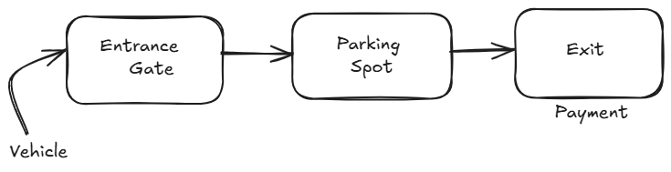
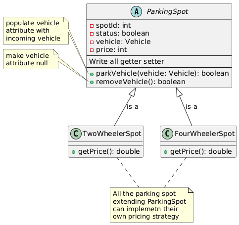
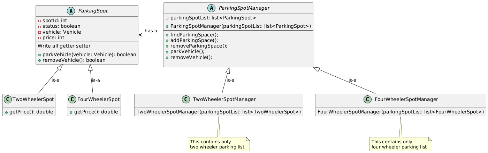
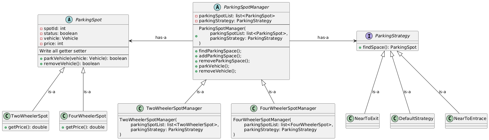
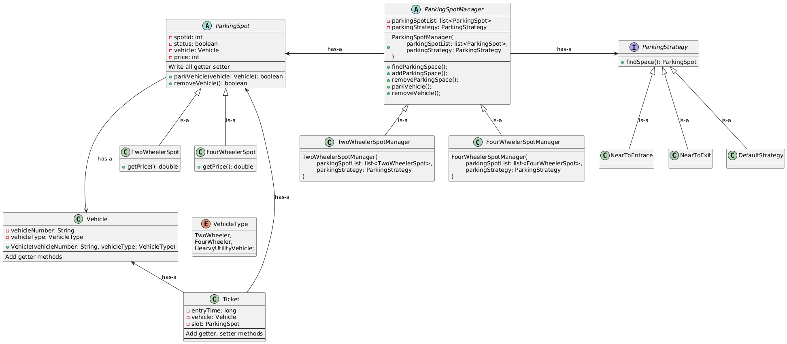
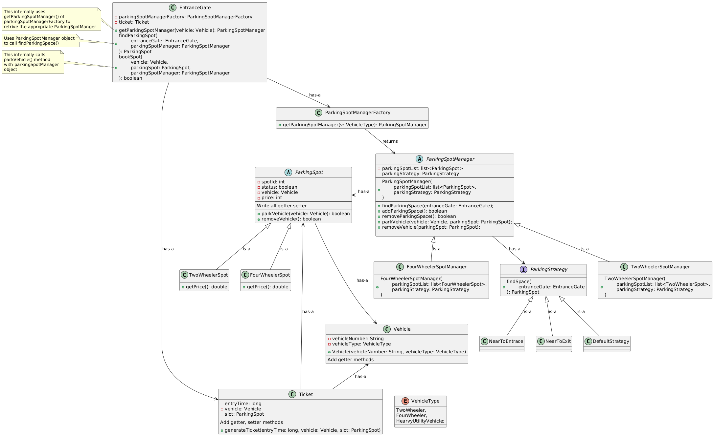
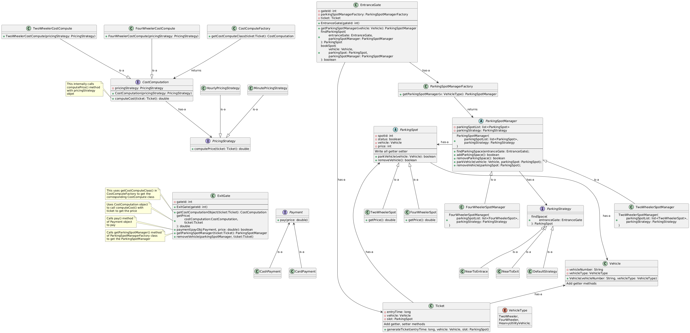

# ParkingLotDesign Project

## Introduction

The ParkingLot project is a simulation of a parking management system. It provides features to manage different types of vehicles, allocate parking spots based on various strategies, and compute parking costs using different pricing strategies. The design and implementation follows the SOLID principal of LLD

## Features

- Manage multiple types of vehicles (Two-Wheeler, Four-Wheeler)
- Allocate parking spots using strategies (Near Entrance, Near Exit)
- Compute parking costs based on hourly or minute-based strategies
- Handle parking ticket generation, entry, and exit gates

## Discussion Notes

### Initial Thought Process:

We start by visualizing a basic parking layout —

To keep the system flexible and scalable, we **begin with a single entrance and a single exit**, but we will **design the architecture in a way that supports multiple entrances/exits** in the future.

### Key Objects in the System:

The main components (entities) involved in the system:
- Vehicle
- Entrance Gate
- Ticket
- Parking Spot
- Payment
- Exit Gate

### Object Properties and Responsibilities:

1. Vehicle
    - Types:
        - Two-wheeler
        - Four-wheeler
        - Can be extended to include electric vehicles, trucks, etc.
    - vehicleNumber

2. Ticket
    - ticketId 
    - vehicleNumber
    - entryTime - For fee calculation.
    - assignedSpotId - Spot where the vehicle is parked

3. Entrance Gate
    - findParkingSpot() -  Smart logic to allocate nearest or most suitable spot.
    - generateTicket() → Issues a ticket and marks the spot as occupied.
    - gateId 
    - updateParkingStatus() → Updates the internal mapping/DB when a new vehicle enters and marked the free spot as occupied

4. Parking Spot
    - spotId
    - spotType → Two-wheeler or Four-wheeler.
    - status → Free / Occupied.
    - Vehicle -> Store the vehicle which is parked
    - price

5. Exit Gate
    - processPayment() → Calculate fee based on time.
    - freeSpot() → Marks the spot as available.
    - gateId
    - generateReceipt()
6.  Payment
    - Can be online (card/UPI) or offline (cash).
    - Supports rate slabs, coupons, penalties (e.g., lost ticket).
    - Rate calculation:
        - Based on parking duration and vehicle type.

7. Additional Design Considerations:

    To make the system interview-ready and more scalable, consider these enhancements:
    - Parking Spot Allocation Strategy:
        - Nearest to exit for quicker exits.
        - Nearest to entrance for ease of parking.
        - Based on accessibility (e.g., EV charging station).
        - Support priority parking (e.g., VIP, handicapped).

8. Concurrency Handling:
    - Multiple gates accessing shared parking data → Need synchronization or distributed lock management.

9. Real-time Availability:
    - Use in-memory storage like Redis for quick access to free spots.

10. Extendability:
    - Add support for:
        - Floors (multi-level parking)
        - Reservation system
        - License plate recognition (ANPR)

## Design Approach 

In low-level system design, there are generally two modeling approaches:

- **Top-Down:** Start from high-level modules and break them into smaller components.

- **Bottom-Up:** Begin with the smallest building blocks and compose them to form the complete system.

For this design, we’ll follow the **Bottom-Up Approach** — starting with the smallest possible unit and gradually building up the system.

### 1. ParkingSpot

We begin by identifying ParkingSpot's attributes and behaviors. Please note that these methods and variables are not fixed — they may evolve as we refine the design during implementation.

We will defined `ParkingSpot` as an abstract class because:
- Different types of vehicles (e.g., two-wheelers, four-wheelers, electric vehicles) require different handling
- The primary difference lies in the **parking fee structure**, **space size**, and potentially in **allocation logic**.

### 2. Parking Spot Manager 

While the `ParkingSpot` class represents a single parking space, in a real-world parking lot — even on a single floor—there are **multiple parking spots** that need to be tracked and managed efficiently.

We need an object responsible for managing collections of parking spots and their availability. This leads us to the concept of a **Parking Spot Manager**.

Since we can have **different types of parking spots** (e.g., for two-wheelers, four-wheelers, EVs, etc.), having a **single manager for all types** could lead to inefficiencies and tightly coupled logic.

Instead, we design a **base abstract class** called `ParkingSpotManager`, and then create **specialized managers** for each vehicle category maintaining its own collection of parking spots.
- `TwoWheelerSpotManager`
- `FourWheelerSpotManager`

### 3. Parking Strategy

In our system, we have a function called `findParkingSpot()` which determines **how a parking spot should be selected**. Since the spot selection logic may vary based on vehicle type, location preferences (e.g., near exit, near elevator), or custom business rules, it makes sense to extract this logic into a separate, pluggable component.

So we define a base interface `ParkingStrategy` with a method like `findSpace()` and create multiple strategy implementations:
- `NearestToExitStrategy`
- `NearestToEntranceStrategy`
- `DefaultStrategy`
- and many more

Each `ParkingSpotManager` can:
- Use a already existing strategy.
- Injecting a custom implementation.

`ParkingSpotManager` stores a reference to the chosen strategy internally using a `ParkingStrategy` and delegate the spot selection logic to it.

Thanks to **method overriding and polymorphism**, the appropriate implementation of `findSpace()`—defined by the chosen strategy—will be executed at runtime. 

This is a exaple of **Strategy Design Pattern**, allowing the spot selection logic to vary independently from the managers that use it.

### 4. Vehicle & Ticket Object

From our discussion so far, it's clear that we need a way to represent different types of vehicles in the system. We’ll define a `VehicleType` enum that includes all supported vehicle categories and a `Vehicle` class to hold all necessary informations of incoming vehicle.

As discussed earlier, we will also introduce a `Ticket` class to encapsulate all relevant information when a vehicle enters the parking lot. This object plays a crucial role in fee calculation, spot tracking.

### 5. Entrance Gate

Let’s now focus on the **Entrance Gate** component. When a vehicle arrives at the entrance, the gate is responsible for:

- Identifying the vehicle type
- Finding an appropriate parking space
- Mark the parking space allocated
- Generate a parking ticket

#### Step1:

However, the **Entrance Gate does not directly perform the parking spot allocation**. Instead, it delegates this responsibility to the appropriate manager based on the vehicle type.

To determine which parking manager should handle the request, we introduce a **Factory Pattern** via a `ParkingManagerFactory`. This factory takes the vehicle type as input and returns the corresponding manager instance:

Examples:
- For `TwoWheeler` - `TwoWheelerSpotManager`
- For `FourWheeler` - `FourWheelerSpotManager`

This encapsulates object creation logic and ensures the Entrance Gate doesn’t need to know the details of various manager implementations.

#### Step2:
Once the `ParkingSpotManager` is obtained, the Entrance Gate calls the method `findParkingSpot()`. Internally, this method uses `parkingSpotManager` object to call `findParkingSpace()` method which agin internally uses predefined `parkingStrategy` — demonstrating method overriding and runtime polymorphism.

Additionally, to support more intelligent parking decisions (like choosing a spot near the same entrance or exit), we pass the Entrance Gate instance as a parameter to the strategy method.

This change allows the strategy logic to consider the gate's location and other metadata when selecting the optimal spot.

#### Step3:
Once a avaible parking spot is fetched `EntranceGate` uses its `bookSpot()` method to call `parkVehicle()` to make the spot unavaible and book the spot for current vehicle.

#### Step4:
Once a parking spot is booked, the Entrance Gate proceeds to generate a `Ticket` object, which includes:
- Vehicle details
- Assigned parking spot
- Entry time
- Entrance gate ID

To enable this, the Entrance Gate should have access to a `TicketGenerator` or a way to create and persist `Ticket` objects.

This design cleanly separates responsibilities, uses the **Strategy Pattern** for parking logic, and the **Factory Pattern** for manager resolution.

### 6. Exit Gate

Let’s now explore the Exit Gate component. When a vehicle is ready to leave, the Exit Gate is responsible for:

- Accepting the ticket
- Calculating the total parking cost
- Marking the parking spot as available
- Handling the payment process

#### Cost Computation 

We define a generic interface called `CostComputation`, which is responsible for calculating the total parking fee. Each vehicle type (e.g., two-wheeler, four-wheeler) can have its **own implementation** of this interface, allowing for vehicle-specific pricing logic.

Concrete implementations:
- `TwoWheelerCostComputation`
- `FourWheelerCostComputation`

These classes encapsulate how the fee is computed for their respective vehicle types.

#### Pricing Strategy

The cost of parking can be calculated in multiple ways—such as:
- Hourly-based pricing
- Per-minute billing
- Dynamic pricing based on time of day or demand

This variability leads us to introduce a `PricingStrategy` abstraction.

To support multiple pricing models, we define an interface `PricingStrategy`. Each concrete pricing method (e.g., `HourlyPricingStrategy`, `PerMinutePricingStrategy`) will implement this interface and encapsulate its own logic for cost calculation.

Now, the CostComputation class doesn’t directly handle the pricing logic. Instead, it holds a reference to a `PricingStrategy` instance.

Each vehicle-specific class (e.g., `TwoWheelerCostCompute`, `FourWheelerCostCompute`) extends `CostComputation` and chooses its own pricing strategy based on business needs.

This design allows easy changes to pricing models without affecting core logic.

#### Payment Integration

To handle different payment systems (e.g., credit card, UPI, mobile wallet, cash), we introduce an abstraction over payment methods. To integrate with various third-party payment gateways or systems, we apply the **Adapter Pattern**.

This allows the Exit Gate to interact with a unified `PaymentProcessor` interface, regardless of the underlying payment service provider.

## Cloning the Repository

ParkingLotDesign is under LowLevelSystemDesign repository. You need to clone the LowLevelSystemDesign repository. You can clone this repository using either SSH or HTTPS.

### SSH
git@github.com:Sudipta-Sen/LowLevelSystemDesign.git

### HTTPS
https://github.com/Sudipta-Sen/LowLevelSystemDesign.git

## Compile the code

### Navigate to the ParkingLotDesign folder

cd low-level-system-design/ParkingLotDesign

### Run make to compile the codebase:

make

### Run the main class:

java -cp bin com.example.main

### Clean up the bin directory

make clean
