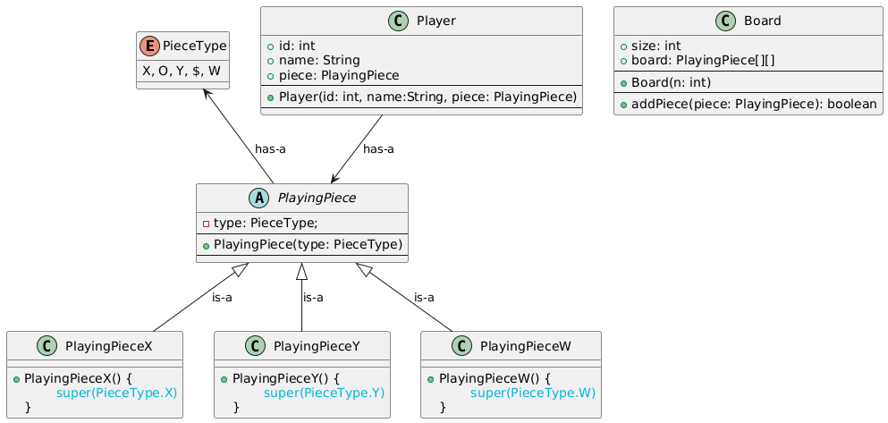
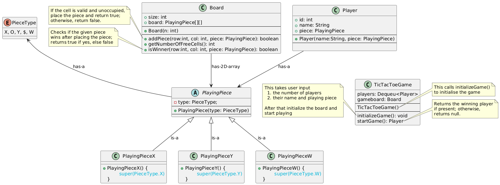

# TicTacToe Game - Low-Level Design

## Introduction
This project is a low-level design implementation of a TicTacToe game with support for up to 5 players. It’s designed to accommodate a minimum of 2 players, making it versatile for small group play. The game dynamically adjusts the board size based on the number of player.

## Rules
Player Count: The game supports between 2 and 5 players.

Board Size: The board size is determined by the number of players, calculated as (number of players + 1) x (number of players + 1).
            For example, with 3 players, the board size will be 4x4.

Winning Condition: A player wins by aligning three of their symbols consecutively either row-wise, column-wise, or diagonally.

## Design Discussion

This is the initial design for the game. The `PlayingPiece` class is designed to be extensible—new piece types can be added easily by creating corresponding classes and updating the `PieceType` enum.

We need a game class which holds the game logic. So lets introduce a `TicTacToeGame` class which holds the logic of the game in `startGame()` method.

Algorithm: `startGame()` in `TicTacToeGame` class

1. Loop until the game ends:
    - Retrieve the list of free cells from the board using `getNumberOfFreeCells()`
    - If no free cells are available:
        - End the game as a draw (no winner).
        - Return `null` (or `None`).
    
2. Select current player:
    - Pick the first player from the deque.
    - Remove this player from the front of the deque.

3. Player makes a move:
    - Ask the player for a cell coordinate to place their piece.
    - Attempt to place the piece using `addPiece(x, y, piece)` in `Board` class.
    - If placement fails:
        - Inform the player and ask for a valid cell again.
        - Continue to next iteration (same player retrying).

4. Check for a winner:
    - Use `isWinner(row, col, player)` method from Board to check if this move wins the game.
    - If winner is found:
        - Return the current player as the winner.

5. No winner yet:
    - Add the current player to the end of the deque.
    - Continue the loop.

**Note:** Currently, the `startGame()` method returns a String. I will updated to return a Player later.

## How to Play

### Setup:
    The game initializes with a specified number of players (between 2 and 5).
    Each player is assigned a unique symbol (e.g., X, O, Y, $, W).

### Turns:
    Players take turns placing their symbol on the board in an empty spot.
    The goal is to be the first to get three of your symbols in a row, column, or diagonal.

### Winning the Game:
    The game automatically checks for a winning condition after each move.
    If a player aligns three of their symbols consecutively, they are declared the winner.
    If no player achieves this before the board is full, the game ends in a draw.

## Cloning the Repository

TicTacToe is under LowLevelSystemDesign repository. You need to clone the LowLevelSystemDesign repository. You can clone this repository using either SSH or HTTPS.

### SSH
git@github.com:Sudipta-Sen/LowLevelSystemDesign.git

### HTTPS
https://github.com/Sudipta-Sen/LowLevelSystemDesign.git

## Compile the code

### Navigate to the ParkingLotDesign folder

cd low-level-system-design/TicTacToe

### Run make to compile the codebase:

make

### Run the main class:

java -cp bin com.example.main

### Clean up the bin directory

make clean