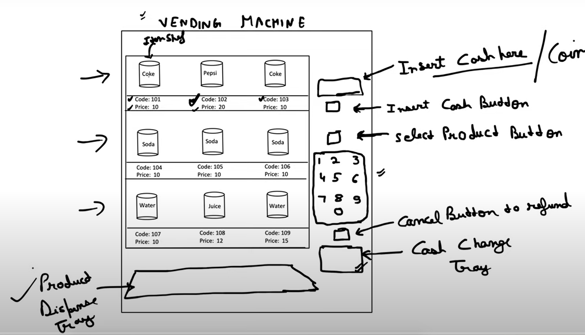
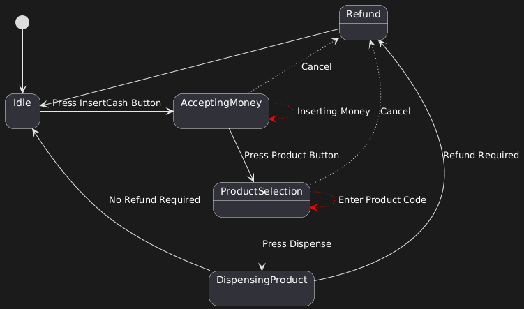
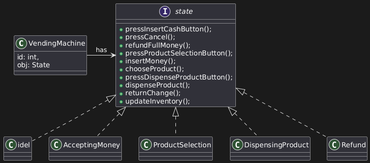
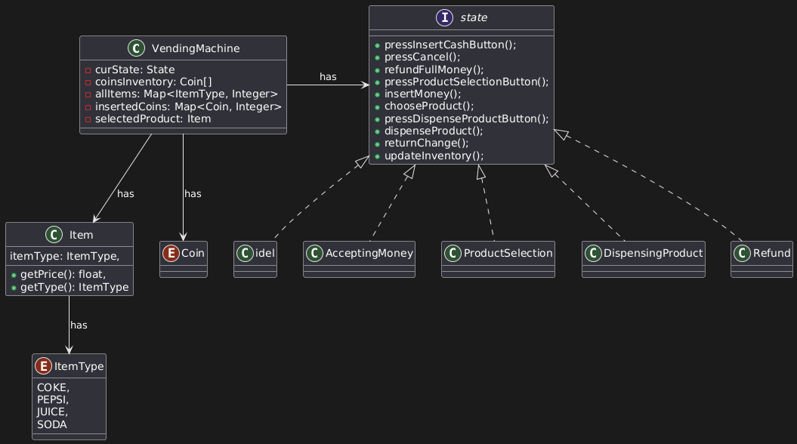

# Vending Machine design

There are various types of vending machines, each with its own design and behavior. However, our vending machine follows these specific constraints:

1. Product Categorization and Pricing:
    - Each product belongs to a specific category, and all products within the same category share a common price structure.
    - For example:
        - Pepsi 200ml belongs to category 103 and costs ₹20.
        - Thums Up 250ml also belongs to category 103, but costs ₹30.

2. Product Placement and Dispensing Logic:
    - Products are **stacked in random or pre-defined slots** within the machine.
    - The physical location of each item is **not fixed per category**, and products may be scattered.
    - It is the responsibility of the **vending machine’s internal design** to determine the location of the selected product and dispense it accordingly.

    

## Happy Path Flow of Vending Machine:

1. **Idle State:** The machine starts in an Idle state.
2. **Insert Cash:** When the user presses the "Insert Cash" button, the machine transitions to the Accepting Money state. It remains in this state as long as the user is inserting money.
3. **Select Product:** Once done, the user presses the "Product" button to enter the Product Selection state. Here, the user can enter the product ID using the keypad. The machine stays in this state until the input is complete.
3. **Cancellation Option:** From both Accepting Money and Product Selection states, the user can cancel the process, and the machine returns to the Idle state.
4. **Dispense Product:** After selecting a product, the user presses "Dispense", and the machine transitions to the Dispensing state to deliver the product.
5. **Refund (if required):** If change needs to be returned, the machine moves to the Refund state, returns the balance, and then transitions back to the Idle state. If no refund is needed, it directly returns to Idle.



So as per the happy flow there are some operations assosiated with speicific state of vending machine like -- 
| State | operation |
|------|---|
| Idle | Press Insert Cash Button|
| Accepting Money | InsertMoney, PressProductButton, Cancel |
| ProductSelection | EnterProductCode, Cancel, Press Dispense Button |
| Dispense | ProductDispense |

since there are operations specific to states, the question is related to state design pattern. Similar questions:
1. Design TV, On, Off state, specific operations to each state

## State Design Pattern 

The State Design Pattern is a behavioral design pattern that allows an object to change its behavior when its internal state changes. From the outside, it appears as if the object has changed its class.

- Key Idea
    - Instead of using multiple `if` or `switch` statements to handle different states, the logic for each state is encapsulated in a separate state class.
    - The context object (e.g., a vending machine) delegates state-specific behavior to the current state object.
    - This makes it easy to add new states or change behavior without modifying the main context.
- Participants
    - Context
        - Maintains an instance of the current state.
        - Delegates requests to the current state object.
        - Can switch between different state objects.
    - State Interface
        - Declares the methods that each state must implement.
    - Concrete States
        - Each concrete class implements behavior specific to one state.
        - Can decide when to transition the context to another state.
- When to Use
    - Use the State pattern when:
        - An object’s behavior depends on its state, and it must change behavior at runtime depending on that state.
        - You have complex conditional logic in multiple places that checks the object’s state.
        - You want to add new states or change behavior without touching existing logic.

## UML Diagram

Each vending machine state will be represented by a `State` interface that defines all possible actions the machine can perform (e.g., `insertCoin()`, `selectProduct()`, `dispenseItem()`, `refund()`).

Concrete state classes will implement this interface and provide state-specific behavior for each action. For actions not valid in a given state, the method can either provide a default response (e.g., "Action not allowed in current state") or throw an UnsupportedOperationException.

The `VendingMachine` class will hold a reference to the current `State` object. Changing the machine’s state simply involves replacing this reference with a different concrete state instance.



To manage different products, we will define an `ItemType` enum representing each category of item (e.g., SNACK, DRINK, CANDY).
An `Item` class will encapsulate an `ItemType` along with a `getPrice()` method that returns the price based on the category.

Items will be organized in shelves (`Shelf` objects), and the machine’s **inventory** will consist of multiple shelves. Each shelf will hold items of a single type, and the vending machine will maintain a collection of shelves to represent its stock.

The vending machine will operate based on states (State Pattern). It will have a method to change its current state. For example, when moving from the **AcceptingMoney** state to the **SelectProduct** state, the coins inserted should remain accessible. This is important so that if the user cancels the purchase, the machine can refund the full amount, or if the product price is less than the amount inserted, it can return the change. For this we are using two variables `insertedCoins` and `selectedProduct`.

This requirement illustrates a common **State Pattern data-sharing challenge** — while the state changes, certain data (e.g., inserted coins) belongs to the vending machine itself, not to the transient state objects. Therefore, the vending machine will hold the coin inventory and pass references to it when necessary.

For item storage, the `VendingMachine` class will contain a list of `Item` objects (or, more realistically, a `Map<ItemType, List<Shelf>>`) to represent the current stock and their positions. When a user selects an item, the machine will retrieve it from the first available position in the corresponding shelf, remove it from inventory, and dispense it.

Along with all these we are also keeping



## Compile the code

### Navigate to the ParkingLotDesign folder

```bash
cd low-level-system-design/VendingMachine
```

### Run make to compile the codebase:

```bash
make
```
### Run the main class:

```bash
java -cp bin machine.Main
```

### Clean up the bin directory

```bash
make clean
```